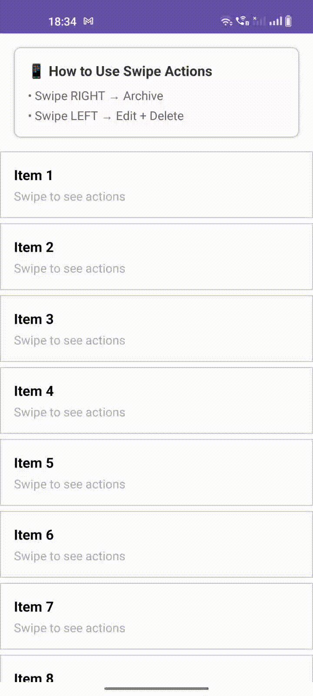

# Swipe Actions RecyclerView Library

[](https://kotlinlang.org)
[](LICENSE)
[](#)

**SwipeActionsRecyclerView** is a powerful, lightweight, and highly customizable Android library that brings **WhatsApp-like swipe-to-reveal actions** to your `RecyclerView`. Swipe left or right to reveal beautiful action buttons — fully animated, smooth, and with full control over behavior and appearance.

No forced item removal — you decide what happens when an action is clicked.

---

## Preview



---

## Features

- **WhatsApp-style smooth swipe animations**
- **Multiple actions per side** (left/right)
- **Custom icons, text, colors, and background per action
- **Long swipe support** → instantly trigger action (e.g., quick archive)
- **Snap open/close** with configurable threshold and duration
- **Haptic feedback** on button tap
- **Only one item open at a time** (like WhatsApp)
- **Full control** — no automatic item removal
- **Elevation on swipe** for depth effect
- **ItemDecoration + ItemTouchHelper** powered — smooth & stable
- **XML + Programmatic** configuration
- **Lightweight & No dependencies**

---

## 📦 Installation

**Step 1.** Add JitPack repository to your root `build.gradle` or `settings.gradle`:

```gradle
// settings.gradle
dependencyResolutionManagement {
    repositories {
        maven { url 'https://jitpack.io' }
    }
}
```

**Step 2.** Add the dependency:

```gradle
dependencies {
    implementation 'com.github.Excelsior-Technologies-Community:SwipeActionsRecyclerView:1.0.0'
}
```

---

## 🚀 Usage

### 1. In XML (Simple)

```xml
<androidx.recyclerview.widget.RecyclerView
    android:id="@+id/recyclerView"
    android:layout_width="match_parent"
    android:layout_height="match_parent"
    app:sar_button_width="90dp"
    app:sar_swipe_threshold="0.25"
    app:sar_snap_back_duration="200" />
```

### 2. In Kotlin (Recommended - Full Control)

```kotlin
val archiveAction = SwipeAction.Builder("archive")
    .text("Archive")
    .icon(R.drawable.ic_archive)
    .backgroundColor(0xFFFF9500.toInt())
    .build()

val editAction = SwipeAction.Builder("edit")
    .text("Edit")
    .icon(R.drawable.ic_edit)
    .backgroundColor(0xFF8E8E93.toInt())
    .build()

val deleteAction = SwipeAction.Builder("delete")
    .text("Delete")
    .icon(R.drawable.ic_delete)
    .backgroundColor(0xFFFF3B30.toInt())
    .build()

val config = SwipeActionConfig.Builder(context)
    .leftActions(listOf(archiveAction))
    .rightActions(listOf(editAction, deleteAction))
    .buttonWidth(resources.getDimension(R.dimen.swipe_button_width))
    .swipeThreshold(0.25f)
    .snapBackDuration(200)
    .hapticOnAction(true)
    .longSwipeEnabled(true)
    .callback(object : SimpleSwipeActionCallback() {
        override fun onActionClicked(position: Int, actionId: String, itemView: View) {
            when (actionId) {
                "archive" -> Toast.makeText(context, "Archived!", Toast.LENGTH_SHORT).show()
                "edit" -> Toast.makeText(context, "Edit clicked", Toast.LENGTH_SHORT).show()
                "delete" -> {
                    // Show confirm dialog or remove item
                    Toast.makeText(context, "Delete clicked", Toast.LENGTH_SHORT).show()
                }
            }
        }
    })
    .build()

SwipeActions.attachTo(recyclerView, config)
```

### Quick Helpers (Extensions)

```kotlin
recyclerView.enableSwipeActions(config)     // Attach
recyclerView.disableSwipeActions()          // Detach
recyclerView.closeOpenSwipe()               // Close current swipe
```

---

## XML Attributes (Optional)

| Attribute                          | Type      | Default      | Description |
|------------------------------------|-----------|--------------|-----------|
| `sar_button_width`                 | dimension | 80dp         | Width of each action button |
| `sar_swipe_threshold`              | float     | 0.3          | Swipe distance to snap open |
| `sar_snap_back_duration`           | integer   | 250ms        | Animation duration |
| `sar_haptic_on_action`             | boolean   | true         | Vibration on tap |
| `sar_longSwipe_enabled`            | boolean   | true         | Enable long swipe quick action |
| `sar_max_buttons_per_side`         | integer   | 3            | Max buttons per direction |

---

## Public API

### SwipeAction

```kotlin
SwipeAction.Builder("id")
    .text("Label")
    .icon(R.drawable.ic_icon)
    .backgroundColor(Color.RED)
    .textColor(Color.WHITE)
    .iconTint(Color.WHITE)
    .contentDescription("Action")
    .build()
```

### Predefined Actions

```kotlin
SwipeAction.delete()    // Red delete
SwipeAction.edit()      // Gray edit
SwipeAction.archive()   // Orange archive
```

### SwipeActions Object

```kotlin
SwipeActions.attachTo(recyclerView, config)
SwipeActions.detachFrom(recyclerView)
SwipeActions.closeOpenSwipe(recyclerView)
SwipeActions.isAttached(recyclerView)
```

### Extensions

```kotlin
recyclerView.enableSwipeActions(config)
recyclerView.disableSwipeActions()
recyclerView.closeOpenSwipe()
```

---

## Methods & Callbacks

```kotlin
abstract class SimpleSwipeActionCallback : SwipeActionCallback {
    override fun onActionClicked(position: Int, actionId: String, itemView: View) { }
    override fun onLongSwipeTriggered(position: Int, direction: SwipeDirection, itemView: View) { }
}
```

You only need to override `onActionClicked` — everything else is optional.

---

## 📄 License

```
MIT License

Copyright (c) 2025 Excelsior Technologies

Permission is hereby granted, free of charge, to any person obtaining a copy
of this software and associated documentation files (the "Software"), to deal
in the Software without restriction, including without limitation the rights
to use, copy, modify, merge, publish, distribute, sublicense, and/or sell
copies of the Software, and to permit persons to whom the Software is
furnished to do so, subject to the following conditions:

The above copyright notice and this permission notice shall be included in all
copies or substantial portions of the Software.

THE SOFTWARE IS PROVIDED "AS IS", WITHOUT WARRANTY OF ANY KIND, EXPRESS OR
IMPLIED, INCLUDING BUT NOT LIMITED TO THE WARRANTIES OF MERCHANTABILITY,
FITNESS FOR A PARTICULAR PURPOSE AND NONINFRINGEMENT. IN NO EVENT SHALL THE
AUTHORS OR COPYRIGHT HOLDERS BE LIABLE FOR ANY CLAIM, DAMAGES OR OTHER
LIABILITY, WHETHER IN AN ACTION OF CONTRACT, TORT OR OTHERWISE, ARISING FROM,
OUT OF OR IN CONNECTION WITH THE SOFTWARE OR THE USE OR OTHER DEALINGS IN THE
SOFTWARE.
```

---
